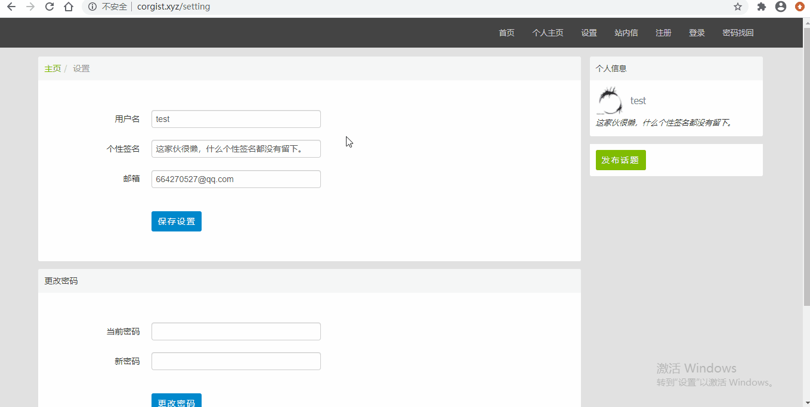

基于 Flask框架 的论坛
================================
### 论坛地址：
* http://www.corgist.xyz/
## 简介
*  实现注册账号与用户登录，管理用户个人设置，重置密码，发布话题与评论回复，站内信、评论的@用户 以及相应的邮件通知等功能
*  使用`MySQL`进行数据存储，基于`SQLAlchemy`实现`ORM`，支持`JOIN`语句操作解决`N+1`问题，提高数据读取效率
*  利用`Jinja2`的模板继承功能，复用`HTML`的通用页面元素，减少重复开发，提高代码维护效率
*  通过`CSRF Token`的设置实现对`CSRF`攻击的防御
*  基于`Redis`实现登录`Session`和`CSRF Token`在多进程下的数据共享，并对请求频率高且计算时长的数据结果进行缓存，进一步优化性能
*  通过配置`多worker`和`gevent`异步协程的`Gunicorn`实现多进程负载均衡、提高并发性能，并使用`Supervisor`进行进程管理
*  使用`Nginx`反向代理静态资源，提升访问性能
*  基于`Celery`的消息队列实现了向重置密码的用户发送邮件以及其他邮件通知功能，可以处理高并发请求、实现削峰并保证数据投递
*  编写`Shell`脚本，实现在服务器上一键部署。

## 环境依赖
* Ubuntu 18.04

* Python 3.6

## 运行部署以及个人文件补充
* 进入服务器`/var/www`下建立项目文件夹，将文件复制进项目文件夹，并以其作为根目录

* 需要在根目录下添加 `secret.py` 、 `config.py` 、 `database_secret.sh` 文件, 内容格式为：

    * `secret.py`
        ```
        database_password = 'MySQL数据库密码'
        secret_key = '自定义的Flask secret_key'
        mail_password = '企业邮箱密码'
        ```
    * `config.py`
        ```
        test_mail = '测试用户的邮箱地址'
        admin_mail = '企业邮箱地址'
        signature = '测试用户的个人签名'
        ```
    * `database_secret.sh`
        ```
        MySQL数据库密码
        ```
## 详细演示
### 注册与登录


### 发布话题与评论回复
话题内容与回复均支持markdown语法


### 话题的发布/删除与CSRF的防御


### 个人设置修改


### 站内信、评论的@功能 以及相应的邮件通知


### 密码重置

